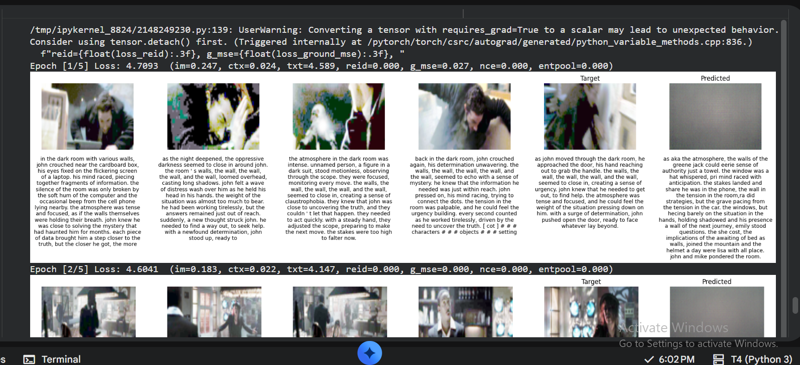
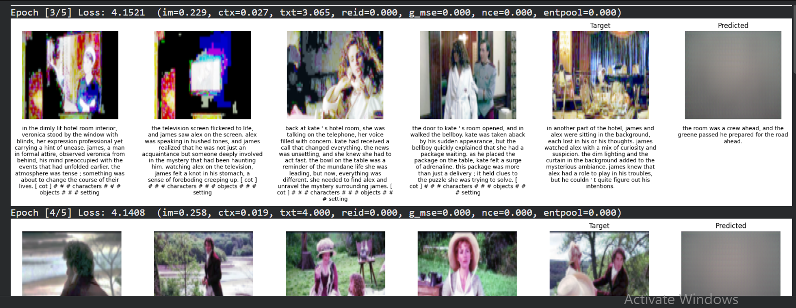
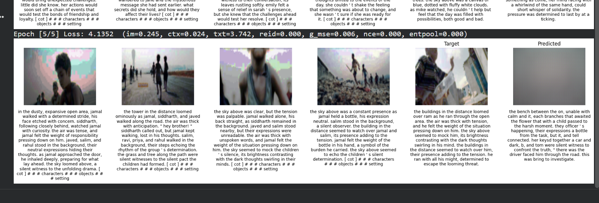
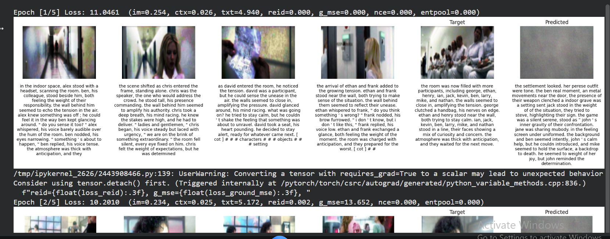
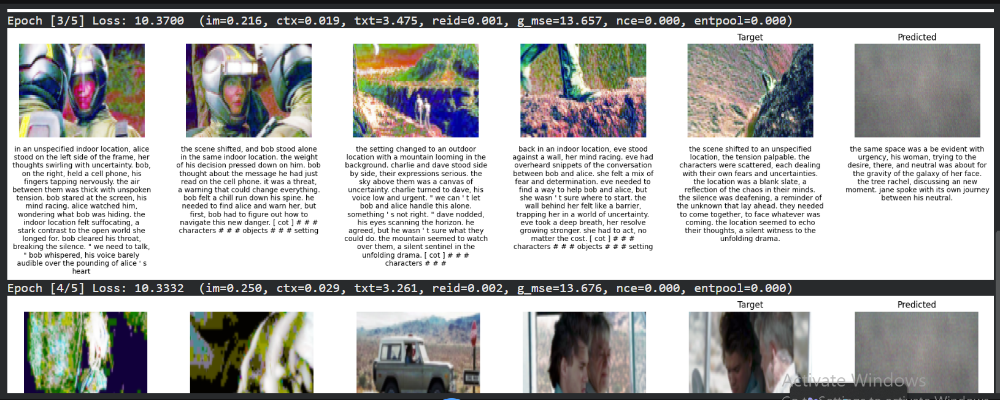
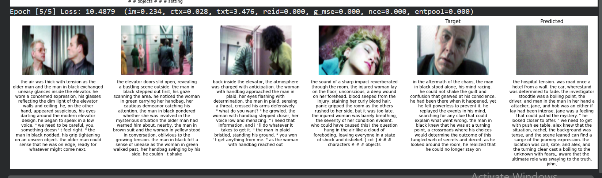

# Multimodal Sequence Prediction Project (Baseline)

## 1. Project Overview

This project focuses on predicting the next element in a multimodal sequence.  
Given a sequence of images and corresponding text descriptions, the model learns to predict the next image-text pair.

---

## 2. Dataset

We use the StoryReasoning dataset (daniel3303/StoryReasoning).  
It contains sequences of images along with text descriptions that represent the story context.

---

## 3. Baseline Model

The baseline model consists of the following components:

- Visual Encoder (CNN-based feature extractor)
- Text Encoder (LSTM/Transformer)
- Multimodal Fusion module
- Sequence Prediction network (LSTM-based)
- Dual decoders for image and text generation

The model learns to predict the next image and text based on previous sequence information without any additional grounding or alignment improvements.

---

## 4. Current Status

Baseline model training has been completed successfully.

---

## 5. Experiment 1: Grounding Improvements

In this experiment, the grounding module was improved using:
- Re-Identification Loss (ReID)
- Frame-aware Grounding MSE Loss

These changes help improve alignment between image regions and text descriptions.

### Modified Code Snapshot

```python
loss_reid = F.mse_loss(z_r1, z_r2)

loss_ground_mse = F.mse_loss(z_r1, z_t_match)
```

### Result

The model showed improved grounding between visual and textual representations.








---

## 6. Experiment 2: Contrastive Alignment

In this experiment, I added a contrastive alignment loss (InfoNCE) to improve multimodal matching between image and text embeddings.

The objective was to:
- bring correct image-text pairs closer
- push incorrect pairs further apart

### Modified Code Snapshot

```python
logits = (z_img @ z_txt.t()) / CONTRASTIVE_TAU
loss_contrast = F.cross_entropy(logits, labels)
```

### Result

The experiment showed stronger multimodal representation learning and improved alignment between visual and textual features.






